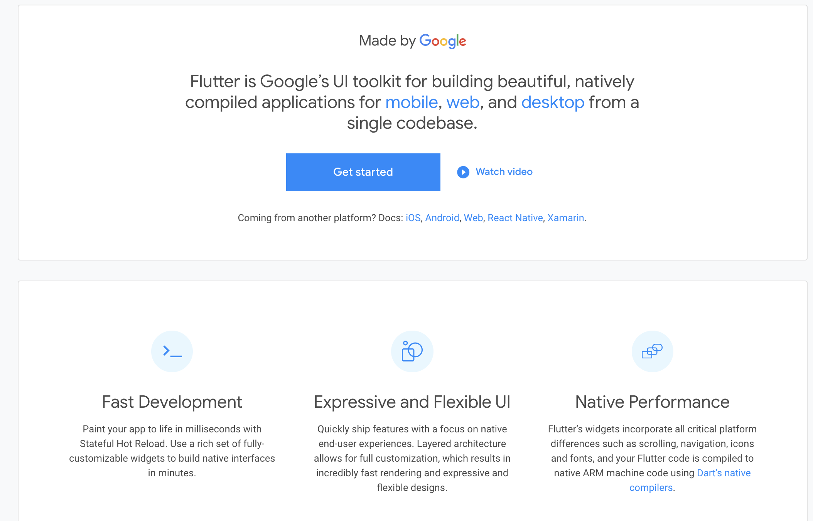
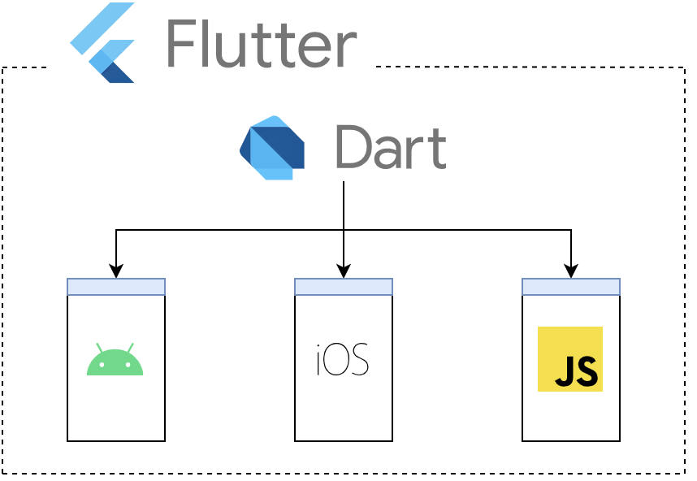
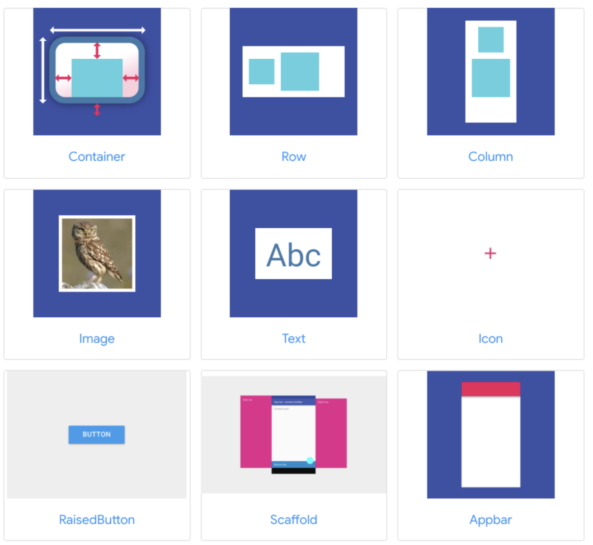
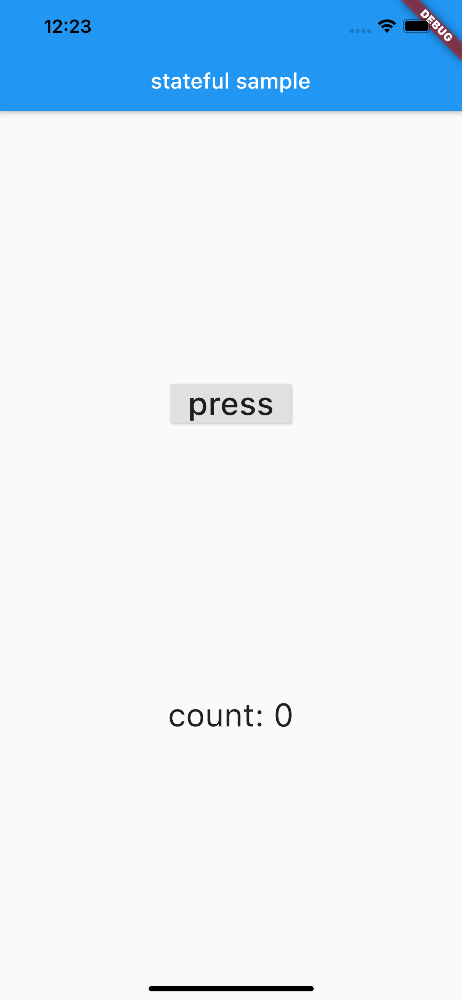
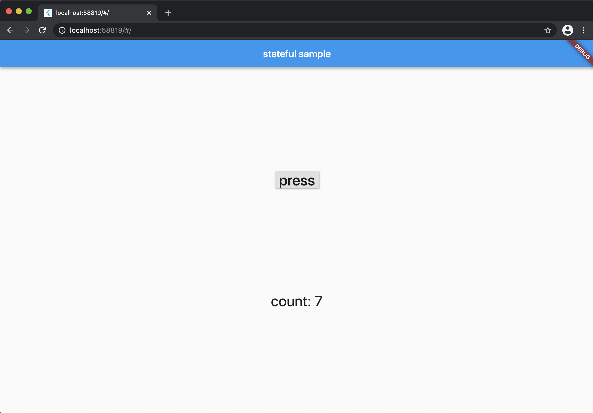

<style>
  pre, code {
    font-size:50px;
  }
</style>
<!--
headingDivider: 1
-->
<!-- _paginate: false -->


<!-- # 目次
- Flutterの概要と特徴
- widgetについて
- デモアプリの紹介
- まとめ -->

# 今日話すこと
- Flutterとは？
- Flutterの特徴
- Flutterのwidget(ウィジェット)の紹介
- 今回作成したデモアプリの紹介

<!-- # Flutterを触ろうと思った背景
* 「大学時代にSwiftやってたけど、すこしわかりづらかったなぁ」
* 「てか、ほかの言語でスマホアプリってつくれないの？」
* 「googleが作ったFlutterっていうものがあるらしい。」
* 「え、iosだけじゃなくandroidアプリもつくれるの？」
* 「ちょっと、きになるからさわってみよ」 -->
<!-- * 「しかも、jストでスマホ開発できる人少ないみたいだから、いい機械だな」 -->

# そもそも、Flutterってなんすか？ &#x1f914;

# Flutterって？

# Flutterって？
- **Google**が開発したクロスプラットフォームのフレームワーク
  - もともと iOS と Android のアプリケーションを開発するためのフレームワークとしてスタート
  - 最近はwebアプリを開発も可能に
- 開発言語は**Dart**を使用する


<!-- - UIが作りやすく、いい感じの見た目のアプリが作りやすい
  - Androidアプリ向けの「Material」系統のものと
  - iOSアプリ向けの「Cupertino」系統のものが用意されている
  - Widgetというcomponentを使う→(後述) -->


<!--  -->


# Dartの書き方はこんな感じ！！


# Dart
<style scoped>
pre, code {
  font-size: 70%;
}
</style>
```dart
void main() { //main関数
  dynamic greeting = 'Good morning';
  for (var i = 0; i < 4; i++) {
    print('hello $i');
  }
  print(greeting);
}
// hello 0, hello 1,hello 2, hello 3, Good morning 
```
- 静的型付け、動的型付け両方に対応
  - dynamicを付与すれば動的型付け変数にできる
- 学習コストが低い
  - Javaやjavascripに書き方に似ている

# Flutterってどんな特徴があるんすか？

# Flutterの特徴
- ios,android,webアプリが単一のコードベースで作れる
- いい感じのUIが簡単に作れる
  - **Widget(ウィジェット)** でUIを構築していく(後述)
- ホットリロードによる高速な開発ができる
- 公式ドキュメントが充実している


# ios,android,webアプリが一気に作れる

Dartで書いたソースコードをios,android,web用に変換してくれる！

# 例) 以下のように実装すると・・・
<style scoped>
pre, code {
  font-size: 70%;
}
/* pre {
  display: block;
  float: left;
} */
</style>
アプリケーションバーと画面中央に文字を表示したもの
```Dart
void main() => runApp(SampleApp());

class SampleApp extends StatelessWidget { //statelessWidgetを継承
  @override
  Widget build(BuildContext context) {
    return MaterialApp(
        home: Scaffold(
          appBar: AppBar(
            title: Text('AppBar'),
          ),
          body: Center(
            child: Text("hello world"),
          ),
        )
    );
  }
}

```
# ios,android,webアプリが作成できる

<!-- 
 
 -->
|iOS|Android|Web|
:-:|:-:|:-:
| |  | |


# いい感じのUIが簡単に作れる
- 用意されているUIコンポーネント(widget)が[Material Design](https://material.io/) ベースで作られている→ある程度の美しさが担保されている
- UI構築は用意されているwidgetを組み合わせるだけ→簡単


<!-- # MeterialDesign
- 2014年にGoogleが発表した「デザインのガイドライン」
- スマートフォン、タブレット、テレビ、、、などのデバイスで、
統一されたデザインを取り入れることにより、操作性も統一され
デバイスが変わっても使いやすいUIを実現→一貫性のあるUI


現実世界のルール(奥行きや、影など、質量)を取り入れることで、直感的な操作を実現。 -->

# ホットリロードによる高速な開発
- Flutterには**ホットリロード機能**が搭載されていて
- コードを更新するとその内容が即座にアプリに反映される
  - (swiftなどのネイティブアプリだと再ビルドが必要で時間がビルドにかかっていた印象)


[ホットリロードのデモ](https://minpro.net/wp-content/uploads/hot-reload-36252b9c05984443ea5cd1960bab0f4ca904a6dfbe71165af4ed7f1b1c037124.gif)

# 公式ドキュメントが充実している
- [cookbook](https://Flutter.dev/docs/cookbook)
  - アニメーション、ナビゲーションなどの様々なサンプルコードが用意されている
  - サンプルコードだけでなく、実装手順も丁寧に書かれている。
- [コードラボ](https://codelabs.developers.google.com/?cat=Flutter)
  - Dartの基本文法やFlutterの基礎的な実装方法が学べる

# ここまでまとめると・・・・

# Flutterは
一つのコードでios,android,webアプリがつくれて
ドキュメント充実してて
ホットリロード機能で高速な開発が可能！


# で、さっき出たWidget(ウィジェット)ってなんすか？


# WidgetはFlutterで使うUIコンポーネントのこと！！


# Widgetの特徴
- 単なる見た目だけでなく、レイアウトや画面遷移、状態管理などもWidgetで実装する
- そのため、アプリを作る際はWidgetをいかに使いこなせるかがとても重要
- 基本的にはWidgetの中にWidgetを重ねて組み合わせることでUIなどを構築していく(Widgetツリー)
- 実装の際は以下２つのWidgetをベースに実装する
  - **StatelessWidget** : State（状態）を持たないWidget(静的)
  - **StatefulWidget** : State（状態）を持つWidget(動的)


# Widgetの種類
<style scoped>
  li {
  margin-left: 40px ;
  float: left;
}
</style>

- Appbar
- BottomNavigationBar
- Card 
- GridView
- ListTile
- Scaffold
- TabBar
- Checkbox
- Radio
- Slider
- Icon 
- Drawer
- FloatingActionButton
- OutlineButton
- PopupMenuButton
- Date & Time Pickers
- Switch
- TextField
- BottomSheet

etc  .....
https://flutter.dev/docs/development/ui/widgets

# Widgetの基本(widgetツリー)
<style scoped>
  section {
    display: block;
  }
  pre, code {
    font-size: 30px;
    width: 50%;
    /* display: block; */
    float: left;
  }
</style>
```dart
MaterialApp(//homeプロパティを持つ
  home: Scaffold(//appBar,bodyプロパティを持つ
    appBar: AppBar(//titleプロパティを持つ
      title: Text('AppBar'),
    ),
    body: Center(//childプロパティを持つ
      child: Text("hello world"),
    ),
  )
);
```


- 各widgetに応じたプロパティを持っていて、
- プロパティに対してwidgetを追加していく
  - widgetの中にwidgetを作成していく(widgetツリー)  

# Widgetの実装方法1
- StatelessWidget or StatefulWidgetを継承した`Class`を作成
- 上記widgetの関数をoverride
  - stateful: `createState`関数(`State`クラスを継承したクラスを返す。)
    - `State`クラス：状態を管理するためのクラス
  - stateless: `build`関数(構築したwidgetツリーを返す。)
- その関数内にそれぞれの機能をもったWidgetを重ねていく
  - statefulWidgetの場合は、Stateクラスに`build`関数を用意
# widgetの実装方法2
<style scoped>
  section {
    display: block;
  }
  pre, code {
    font-size: 20px;
    /* width: 50%; */
    
    /* float: left; */
  }
</style>
```dart
// statelessWidgetの実装例
class Sample1 extends StatelessWidget { // StatelessWidgetを継承したSample1クラス
  @override
  Widget build(BuildContext context) {　// StatelessWidgetが持つbuild関数をoverride
    // widgetツリーを返す。
  }
}
// StatefulWidgetの実装例
class Sample2 extends StatefulWidget { // StatefulWidgetを継承したSample2クラスを作成
  @override
  Sample2State createState() => new Sample2State(); // StatefulWidgetが持つcreateState関数をoverride
}
// Stateクラス
class Sample2State extends State<Sample2> { //Stateクラスを継承したクラスを作成(状態を管理するためのクラス)
  @override
  Widget build(BuildContext context) { //Stateクラスの持つbuild関数をoverride
    // widgetツリーを返す
  }
}
```

# 実装例1
<style>
  pre, code {
    font-size: 22px;
  }
</style>
```Dart
import 'package:flutter/material.dart';

void main() => runApp(SampleApp());

// statelesswidget・・State（状態）を持たないWidget
class SampleApp extends StatelessWidget {
  @override
  Widget build(BuildContext context) {
    //Android系の見た目や挙動で統一するためのWidget
    return MaterialApp(
        home: Scaffold(//アプリのタイトル欄と背景を用意
          appBar: AppBar(
            title: Text('AppBar'),
          ),
          body: Center(
            child: Text("hello world"),
          ),
        )
    );
  }
}

```
<!--  -->


# 実行結果
|iOS|Android|Web|
:-:|:-:|:-:
| |  | |


<!-- # Demo1
- statelessWidgetのサンプルコード
    <p class="codepen" data-height="265" data-theme-id="light" data-default-tab="js,result" data-user="hgaji" data-slug-hash="BaQryjb" style="height: 265px; box-sizing: border-box; display: flex; align-items: center; justify-content: center; border: 2px solid; margin: 1em 0; padding: 1em;" data-pen-title="statelessWidgetSample">
    <span>See the Pen <a href="https://codepen.io/hgaji/pen/BaQryjb">
    statelessWidgetSample</a> by hgaji (<a href="https://codepen.io/hgaji">@hgaji</a>)
    on <a href="https://codepen.io">CodePen</a>.</span>
    </p>
    <script async src="https://cpwebassets.codepen.io/assets/embed/ei.js"></script> -->

# 実装例2
<style scoped>
  pre {
    font-size: 15px;
  }
</style>

```dart
import 'package:flutter/material.dart';

void main() => runApp(SampleApp());

class SampleApp extends StatefulWidget {
  @override
  SampleState createState() => new SampleState();
}

class SampleState extends State<SampleApp> {
  int count = 0;
  @override
  Widget build(BuildContext context) {
    return MaterialApp(
      home: Scaffold(
        appBar: AppBar(
            title: Text("stateful sample")
        ),
        body: Center(
          child: Column(
            mainAxisAlignment: MainAxisAlignment.spaceEvenly,
            children: [
              RaisedButton(onPressed: ()=>{
                // 再描画する
                setState(()=> count++)
              },
              child: Text('press',style: TextStyle(fontSize: 30)),
              ),
              Text('count: $count',style: TextStyle(fontSize: 30))
            ],
          ),
        ),
      ),
    );
  }
}
```


# 実行結果
|  ios  |  Android | Web|
| :-: | :-: | :-:|
|   |   | |
<!--  -->


<!-- # Demo2
- statefulWidgetのサンプルコード
  <p class="codepen" data-height="265" data-theme-id="light" data-default-tab="js,result" data-user="hgaji" data-slug-hash="LYbJNxj" style="height: 265px; box-sizing: border-box; display: flex; align-items: center; justify-content: center; border: 2px solid; margin: 1em 0; padding: 1em;" data-pen-title="StatefulwidgetSample">
    <span>See the Pen <a href="https://codepen.io/hgaji/pen/LYbJNxj">
    StatefulwidgetSample</a> by hgaji (<a href="https://codepen.io/hgaji">@hgaji</a>)
    on <a href="https://codepen.io">CodePen</a>.</span>
  </p>
  <script async src="https://cpwebassets.codepen.io/assets/embed/ei.js"></script> -->

# demoアプリ紹介

### 概要 
1. スマホのカメラの映像ソースをrtmpでpush
2. rtmpサーバー(nginx)で受けてhlsに変換して配信する

- 視聴確認: https://www.hlsplayer.net/


# まとめ
- Flutterとは
  - ios,andorid,webアプリが作れるフレームワーク 
  - widgetを用いてUIを構築していく
    - statefulWidgetとstatelessWidget


環境構築などはコンフルにまとめているので、興味のある方は見てみてください


# 参考
- https://www.flutter-study.dev/introduction/about-flutter/
- https://qiita.com/matsukatsu/items/e289e30231fffb1e4502

# ご静聴ありがとうございました！！