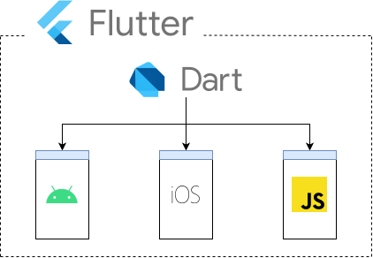
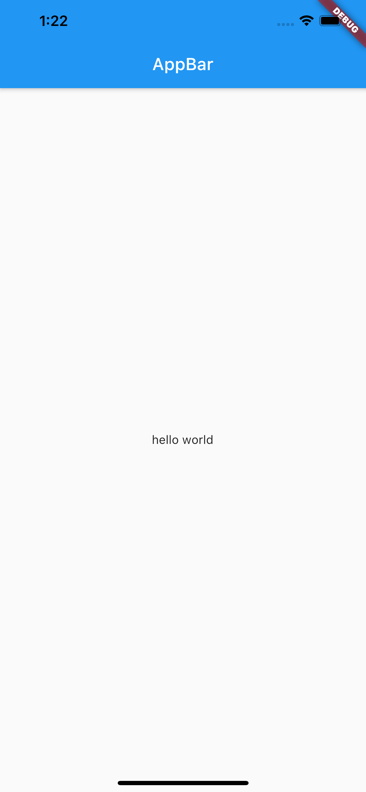
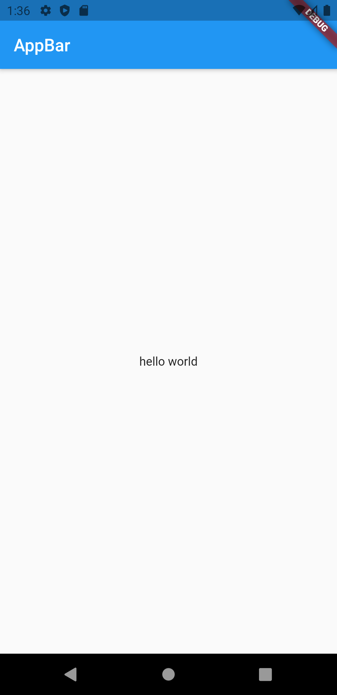
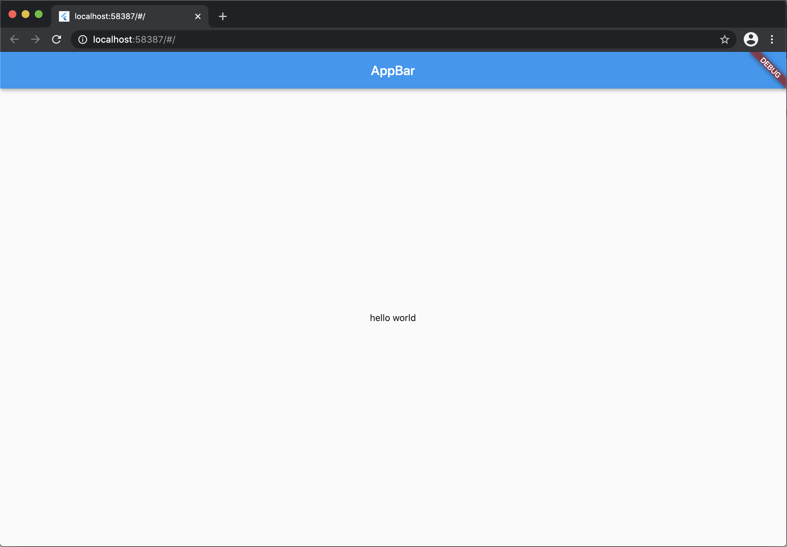

<!-- _class: lead -->
<!-- _paginate: false -->


---

# 目次
- flutterの概要と特徴
- widgetについて
- デモアプリの紹介
- まとめ
---
<!-- _class: lead -->
# そもそも、flutterってなんなん？
---
<!-- _class: lead -->
# ios,Android,Webアプリが作れる       
# すげーやつ!!
---
<!-- _class: lead -->
# もっと具体的に言うと・・・
---
# flutterって？
- **Google**が開発したフレームワーク
- Dartという言語を使う
- ios,android,webアプリが作れる
- UIが作りやすく、いい感じの見た目にできる
  - [マテリアルデザイン](https://ja.wikipedia.org/wiki/%E3%83%9E%E3%83%86%E3%83%AA%E3%82%A2%E3%83%AB%E3%83%87%E3%82%B6%E3%82%A4%E3%83%B3)ベース
  - Widgetというcomponentを使う→(後述)




---
<!-- _class: lead -->
# ちなみに、Dartの書き方はこんな感じ！！

---
# Dartのサンプルコード

```dart
void main() {
  for (var i = 0; i < 4; i++) {
    print('hello $i');
  }
}
// hello 0, hello 1,hello 2, hello 3
```

javaににていて、そんなに難しくはない印象

---
<!-- _class: lead -->
# flutterの特徴は？

---
<!-- _class: lead -->
## 1.公式ドキュメントが充実している！！
---
# ドキュメントの充実性
- [cookbook](https://flutter.dev/docs/cookbook)
  - アニメーション、デザイン、ナビゲーションなどの様々なサンプルコードが用意されている
  - サンプルコードだけでなく、実装手順も丁寧に書かれている。
- [コードラボ](https://codelabs.developers.google.com/?cat=flutter)
  - Dartの基本文法やflutterの基礎的な実装方法が学べる

---
<!-- _class: lead -->
## 2. ホットロードによる高速な開発が可能！

---
<!-- _class: lead -->

# ネイティブアプリ(SwiftやKotlin)での開発だと・・・
---
<!-- _class: lead -->
# コードを反映するためには基本的に再ビルドする必要

# その上、ビルド時間がかかる......

---
<!-- _class: lead -->

# それに対しflutterでは....
---
<!-- _class: lead -->
# flutterには**ホットロード機能**が存在

---
<!-- _class: lead -->
# ホットリロードを使うことによりコードを更新するたびにアプリに即座に反映できる→高速な開発が可能

---


# ここまでまとめると・・・・
## flutterは
- 一つのコードでios,android,webアプリがつくれて
- ドキュメント充実してて
- ネイティブアプリよりも高速な開発が可能！

---

<!-- _class: lead -->
# ところで、さっき出てきたWidget(ウィジェット)ってなんすか？
---
<!-- _class: lead -->
# WidgetはFlutterで使うUIコンポーネントのこと！！

---
# Widget
- flutterで使用するUIコンポーネント
- 見た目だけでなく、画面遷移や状態管理などもwidgetで実装
- Widget大きく二種類存在
  - **StatelessWidget** : State（状態）を持たないWidget
  - **StatefulWidget** : State（状態）を持つWidget
- ツリー状で構成されるため、Widgetの中に更にWidgetを重ねて組み合わせることによりUIを構築
- 実装では上記２つのwidgetを継承して開発

---
# Widgetの種類
|  Appbar  | BottomNavigationBar | Card| GridView| ListTile|
| :---: | :---: | :---:| :---: | :---: |
|   |  |  |  |  |

|  Scaffold  | TabBar | Checkbox| Radio|Slider|Icon |
| :---: | :---: | :---:|:---:|:---:|:---:|
|   |  | | | | |


---
# 実装例
```dart
class WidgetSample extends StatelessWidget {
  @override
  Widget build(BuildContext context) {
    return Scaffold(//各画面のベースとなるレイアウトを作るために用いるWidget
      appBar:AppBar(
        title:Text('AppBar'),
      ),
      body: Center(//body
        child: Text("hello world"),
      ),
    );
  }
}
```
---
# 実行結果
|  ios  |  Android | Web|
| :---: | :---: | :---:|
|    |     | |

簡単に３つアプリの開発が可能！！！

---

# demoアプリ紹介
* このアプリはwebには対応してません

### 概要 
1. スマホのカメラの映像ソースをrtmpでpush
2. rtmpサーバー(nginx)で受けてhlsに変換して配信する



---
# 環境構築
- windows
<!-- 環境構築はconfluに記述する -->

- mac
<!-- 環境構築はconflueに記述する -->

---

# Demo
- statelessWidgetのサンプルコード
    <p class="codepen" data-height="265" data-theme-id="light" data-default-tab="js,result" data-user="hgaji" data-slug-hash="BaQryjb" style="height: 265px; box-sizing: border-box; display: flex; align-items: center; justify-content: center; border: 2px solid; margin: 1em 0; padding: 1em;" data-pen-title="statelessWidgetSample">
    <span>See the Pen <a href="https://codepen.io/hgaji/pen/BaQryjb">
    statelessWidgetSample</a> by hgaji (<a href="https://codepen.io/hgaji">@hgaji</a>)
    on <a href="https://codepen.io">CodePen</a>.</span>
    </p>
    <script async src="https://cpwebassets.codepen.io/assets/embed/ei.js"></script>
---
# まとめ
- flutterとは
  - ios,andorid,webアプリが作れるフレームワーク 
